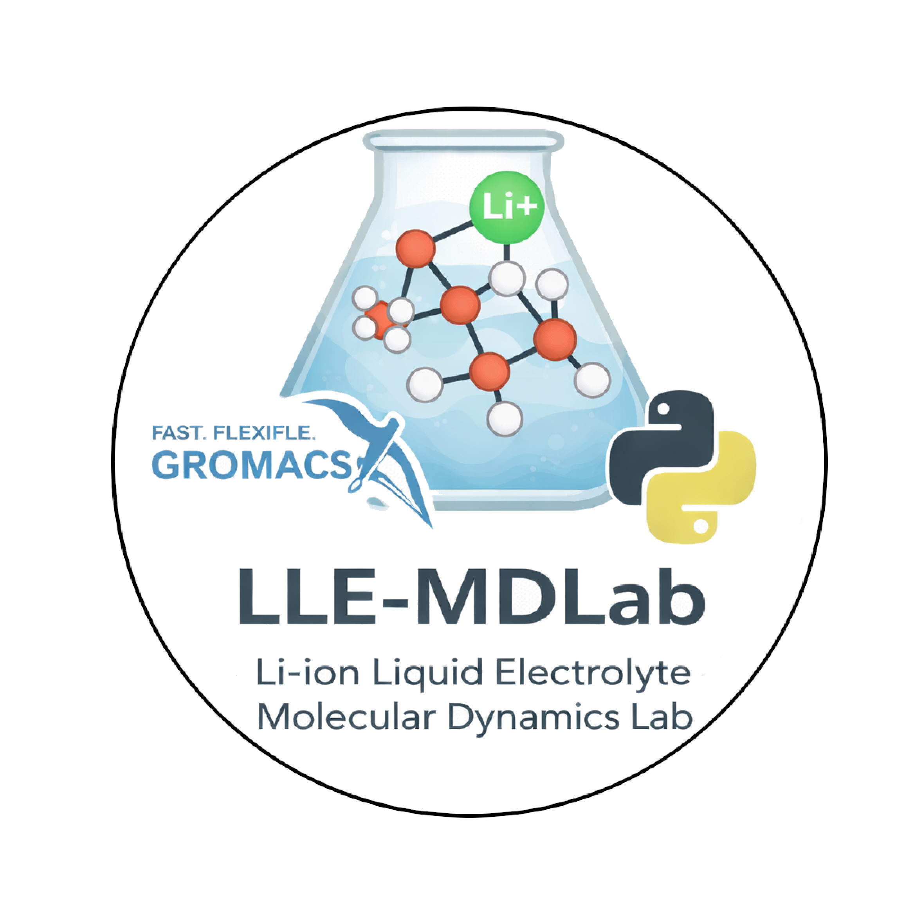

`LLE-MDLab` Li-ion Liquid Electrolyte Molecular Dynamics Lab (LLE-MDLab)
`code_traPPE.py` is a Python-based command-line workflow designed to construct molecular models of electrolytes composed of LiPF₆ salt and one or more organic carbonate solvents parameterized with the TraPPE force field.

Given a target box size, salt concentration, and solvent composition, the code computes the number of ion pairs and solvent molecules, generates an initial configuration using Packmol, optionally rescales ionic charges, and prepares a fully self-contained GROMACS simulation directory. The generated output includes topology files, force-field definitions, molecular dynamics parameter files, and execution scripts for both local and SLURM-based cluster environments.

## Installation Requirements:

## Installation

## Running LLE-MDLab

## Authors and acknowledgment
- Dr. Henry Andres Cortes, BCAM - Basque Center for Applied Mathematics, Spain
- Dr. Mauricio Rincon Bonilla, BCAM - Basque Center for Applied Mathematics, Spain
- Prof. Elena Akhmatskaya, BCAM - Basque Center for Applied Mathematics, Spain

